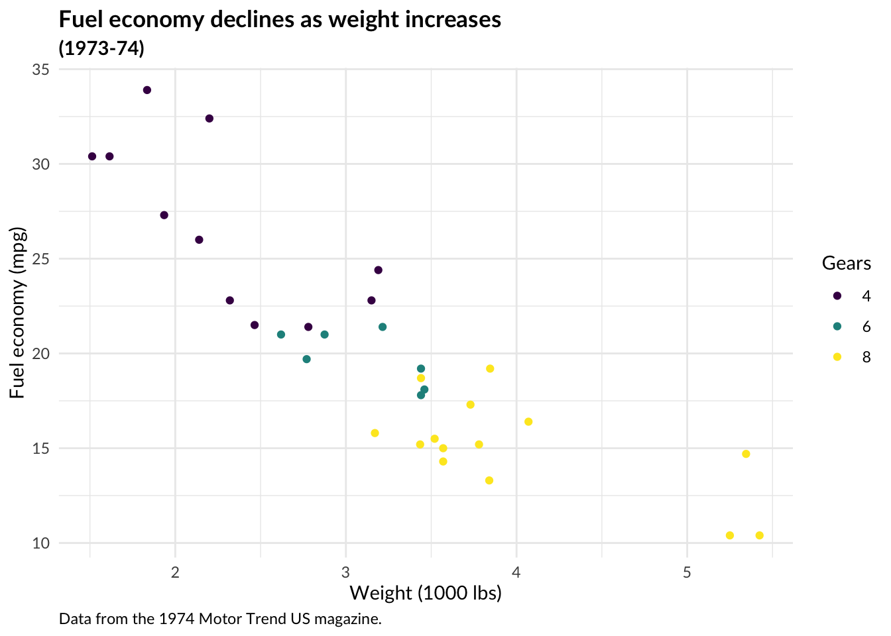

<!-- README.md is generated from README.Rmd. Please edit that file -->

# jbplot

<!-- badges: start -->

[](https://github.com/jabenninghoff/jbplot/actions)
[](https://github.com/jabenninghoff/jbplot/actions)
[](https://app.codecov.io/gh/jabenninghoff/jbplot?branch=main)
<!-- badges: end -->

## Overview

**A Personal Collection of ggplot2 Themes:** My personal collection of
ggplot2 themes and styles.

Feel free to use and/or fork this project!

## Installation

You can install the development version of jbplot from
[GitHub](https://github.com/) with:

``` r
# install.packages("remotes")
remotes::install_github("jabenninghoff/jbplot")
```

Or using renv:

``` r
# install.packages("renv")
renv::install("jabenninghoff/jbplot")
```

## Development

- Changelog: See “Changelog” or `NEWS.md`.
- Planned: [TODO](TODO.md)

## Examples

jbplot allows creation of styled plots, such as this `mtcars` example,
adapted from `ggplot2::theme_minimal()`:

``` r
library(ggplot2)
library(jbplot)

ggplot(mtcars, aes(x = wt, y = mpg, color = factor(cyl))) +
  geom_point() +
  labs(
    title = "Fuel economy declines as weight increases",
    subtitle = "(1973-74)",
    caption = "Data from the 1974 Motor Trend US magazine.",
    x = "Weight (1000 lbs)",
    y = "Fuel economy (mpg)",
    color = "Gears"
  ) +
  theme_quo() +
  scale_color_viridis_d()
```



For more information, see the “jbplot ggplot2 style”
[vignette](https://jabenninghoff.github.io/jbplot/articles/jbplot-style.html).
